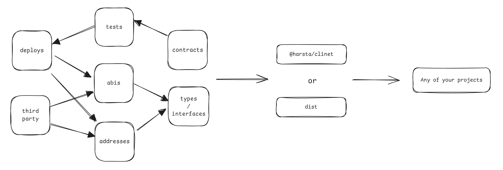

## harsta

I have been searching for a way to integrate Hardhat with other frameworks (such as nextjs/vue), but unfortunately, I have not found one. Therefore, I plan to implement it myself.

**harsta** is a contract development tool based on Hardhat, designed to streamline the development, testing, and referencing of contracts, addresses, ABIs, and contract instances.

**harsta** simplifies the configuration files for end-to-end development and contract writing. You only need to write one configuration that can be referenced anywhere.



- [Address visualization and third-party ABI](#directory)
- [Harsta Config File](#config)
- [Automated deployment](#deployments)
- [Wagmi Support](#wagmi)
- [Tests based on hardhat / hardhat-deploy](#tests)

## Installation

You can quickly create a project like Hardhat using the command `pnpm harsta create`, or you can install it separately in any project:

```sh
$ pnpm harsta create

# OR

$ pnpm install hardhat harsta @harsta/client

# OR

$ pnpm install hardhat harsta
```

> Note: `@harsta/client` is optional. If installed, `harsta compile` will automatically be bundled into `@harsta/client`.

## Directory

- `contracts/`, `test/`

The location of contract source files and tests, similar to Hardhat.

- `config/addresses.ts`

This file contains all contract addresses used in the project. You can customize this file, and it will be automatically updated after contract updates/deployments.

```ts
export default {
  [chainIdNumber]: { [contractName]: '0x...' }
}
```

- `config/fragments/*.json`

Additional third-party contracts used, which will be compiled into contract instances.

## Quick Start

**harsta** has three key commands:

```sh
  harsta compile  Compile and output the directory
  harsta test     Run integration tests
  harsta deploy   Deploy and save deployments
```

To compile your contracts in `contracts/`:

```
$ pnpm harsta compile
```

If `@harsta/client` is not installed, **harsta** will default output to `dist`. You can change the output directory with the `--output` option.

After compilation, if you install `@harsta/client`, you can directly reference `@harsta/client` as follows:

```ts
import {
  addresses,
  chains,
  contracts,
  defaultChain,
  interfaces,
} from '@harsta/client'

// Automatically import contract addresses from the default chain
const lock = contracts.Lock.resolve()
const time = await lock.unlockTime()

// Use other addresses through attach
const lock2 = contracts.Lock.attach(addresses[chains.ethereum.id].Lock)

// Connect to a contract by passing a chain
const lock3 = contracts.Lock.resolve(chains.ethereum, '0x...')
```

Send and write contract:

```ts
import { contracts, updateRunner } from '@harsta/client'
// Update the default runner (singer) to support transactions
import { Wallet } from 'ethers'

const wallet = new Wallet('...')
updateRunner(wallet)

const lock = contracts.Lock.resolve()
const transaction = await lock.withdraw()
```

## Config

**harsta**'s config is similar to Hardhat but more streamlined and simple, with comprehensive chain config.

```ts
import { defineConfig } from 'harsta'
import 'dotenv/config'

const config = defineConfig({
  solidity: '0.8.20',
  defaultNetwork: 'geneva',
  namedAccounts: {/* ... */},
  networks: {
    ethereum: {
      name: 'Ethereum',
      rpc: '...',
      id: 0,
      icon: '',
      currency: {
        decimals: 18,
        name: 'ETH',
        symbol: 'ETH'
      },
      explorer: {/* ... */},
      // Optional, if not written, it will not be accepted by Hardhat
      deploy: {
        accounts: [/* account #0 | account #1 */],
        saveDeployments: true,
        allowUnlimitedContractSize: true,
        gas: 'auto',
        gasPrice: 'auto',
      },
      verify: {
        uri: '...',
        key: '...'
      }
    }
  },
  // ...
})
```

## Deployments

After writing your contracts, you need to define the `deployments` in the configuration file:

```ts
const config = defileConfig({
  deployments: {
    Constant1: { args: [/* args... */] },
    Constant2: { update: 'proxy', args: async env => [/* args... */] },
    Constant3: { update: 'uups', args: () => [/* ...args */] }
  }
})
```

Next, deploy to the desired chain:

```sh
$ pnpm harsta deploy --network [your network]
```

After deployment, the `config/addresses.ts` file will be automatically updated and recompiled.

### Update

If your contract files are updated, rerun the script:

- `contracts/Constant1.sol` has been modified
- `contracts/Constant2.sol` has been modified

Rerunning the `deploy` script will redeploy the `Constant1|Constant2` contracts.

If your contract is an upgradable contract, create a new file:

- `contracts/Constant1.sol` original contract
- `contracts/Constant1V1.sol` upgraded contract

Rerunning `deploy` will upgrade the contract.

## Wagmi

**harsta** naturally supports wagmi. By adding a few lines of code, you can use the compiled information and contracts of all chains:

config.ts:

```ts
import { createConfig, http } from '@wagmi/core'
import { createClient } from 'viem'
import { chains } from '@harsta/client'

export const config = createConfig({
  chains: [chains.ethereum, chains.sepolia],
  client({ chain }) {
    return createClient({ chain, transport: http() })
  },
})
```

App.tsx:

```tsx
import { WagmiProvider, useClient, useConnectorClient } from 'wagmi'
import { subscribeEthersAdapters } from '@harsta/client/wagmi'
import { config } from './config'

function SubscribeWagmiConfig() {
  subscribeEthersAdapters({
    useClient,
    useConnectorClient,
  })
  return null
}

function App() {
  return (
    <WagmiProvider config={config}>
      <SubscribeWagmiConfig />
      {/* your page content */}
    </WagmiProvider>
  )
}
```

Any page:

```tsx
import { addresses, contracts } from '@harsta/client'
import { useAccount } from 'wagmi'

function Page() {
  const { isConnected } = useAccount()
  async function withdraw() {
    const lock = contracts.Lock.resolve('singer')
    const transaction = await lock.withdraw()
  }
  return (
    <>
      {isConnected && (
        <button onClick={withdraw}>
          Withdraw
        </button>
      )}
    </>
  )
}
export default Page
```

By modifying `.env` to change the default chain and configuration used by the contract:

```
NEXT_PUBLIC_DEFAULT_CHAIN = 'sepolia'
```

## Tests

You can ensure that deployment scripts are executed in tests by calling `await deployments.fixture(['MyContract'])`. This is optimized so that if multiple tests use the same contract, the deployment will be done once, and each test will start in exactly the same state.

```ts
import { deployments, ethers } from 'hardhat'
import { expect } from 'chai'

describe('storage contract', () => {
  beforeEach(async () => {
    await deployments.fixture(['Storage'])
  })
  it('test', async () => {
    const Storage = await deployments.get('Storage')
    const storage = await ethers.getContractAt('Storage', Storage.address)
    // ...
  })
})
```
